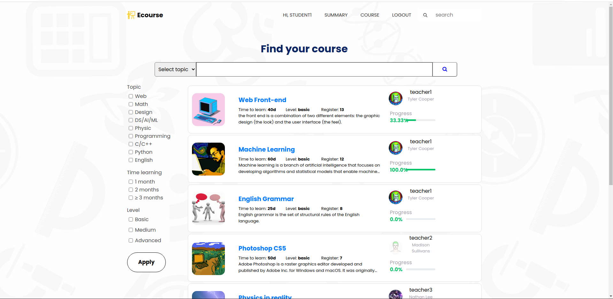
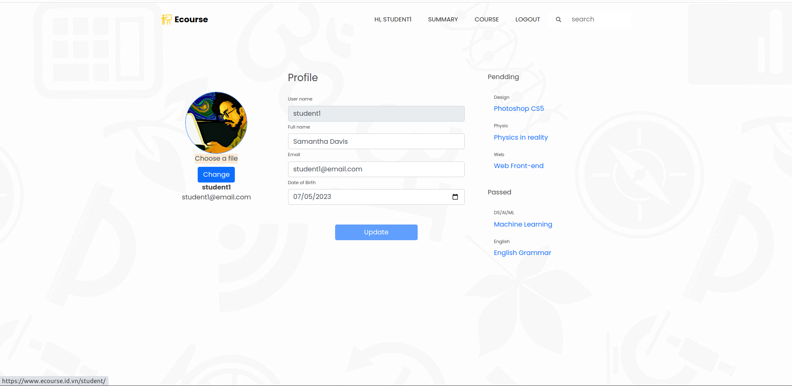
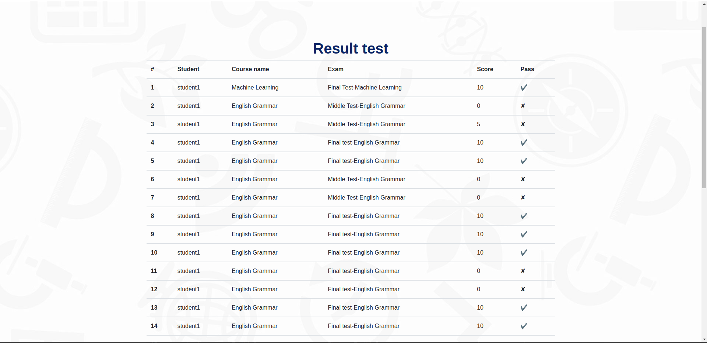

# Ecourse - Online Learning
> Ecourse help the students can learn everywhere, everytime on this website with Video lesson and Online exam.
> Live demo [_here_](https://www.ecourse.id.vn/). 

## Table of Contents
* [General Info](#general-information)
* [Technologies Used](#technologies-used)
* [Features](#features)
* [Screenshots](#screenshots)
* [Setup](#setup)
* [Usage](#usage)
* [Project Status](#project-status)
* [Room for Improvement](#room-for-improvement)
* [Acknowledgements](#acknowledgements)
* [Contact](#contact)
<!-- * [License](#license) -->


## General Information
- On this web site, teacher can upload video lesson and create exam for student. After the student has taken the test, the score will be automatically graded. If average score of exam is greater than 7.5, student will have a certificate of this course. Student can export certificate to pdf for sharing anywhere.
- This website connects between students and teachers. Student will have a convenience learning method.


## Technologies Used
- Django - version 4.2.2
- Postgres- version 13.4
- Redis - version 3.0.1
- Django REST Framework - version 3.14.0
- django-material-admin- verision 1.8.6
- xhtml2pdf - version 0.2.11
- django-webpush - version 0.3.5
...

## Features
List the ready features here:
- Learning with video lesson
- Get certificate and export to PDF file
- Automatically grade the test 
- Push notification on system bar.
- Learn progress overview


## Screenshots
- Database

- Home page

- Course page

- Course detail

- Login

- Register
- 
- Profile

- Certificate

- Summary

- Lesson

- Exam

- Exam result

-Test result summary


## Setup
### Runing Docker-Compose
1. Clone this repo
```
git clone https://github.com/gavin-go-dang/demo1_ECourse.git
```
2. Set up .env file at root project folder
```
SECRET_KEY=
DB_NAME=
DB_USER=
DB_PASSWORD=
DB_HOST_DEV=
DB_HOST_STAGGING=
DB_PORT=
EMAIL_BACKEND=
MAILGUN_ACCESS_KEY=
MAILGUN_SERVER_NAME=
EMAIL_PORT=
SENTRY_KEY_PRODUCTION=
SENTRY_KEY_STAGGING=
VAPID_PUBLIC_KEY=
VAPID_PRIVATE_KEY=
VAPID_ADMIN_EMAIL=
AWS_ACCESS_KEY_ID=
AWS_SECRET_ACCESS_KEY=
AWS_STORAGE_BUCKET_NAME=
CLIENT_ID=
CLIENT_SECRET=
AUTH_APP=
```
3. Run docker-compose
```
docker-compose up --build
```

### Running without Docker-Compose
1. Clone this repo
1. Set up .env file
1. Configure the environment variables.
```
virtualenv env
source env/bin/activation
```
4. Install lib and package
```
pip install -r requirements.txt
```

5. Run the migrations
```
python manage.py migrate
python manage.py runserver
```
6. Load data:
```
python3 manage.py loaddata data_sample.json
```
7. Runserver
```
python manage.py runserver
```

## Project Status
Project is: _in progress_ 


## Contact
Created by Gavin Dang - feel free to contact me!
Email: gavin.dang.goldenowl@gmail.com

